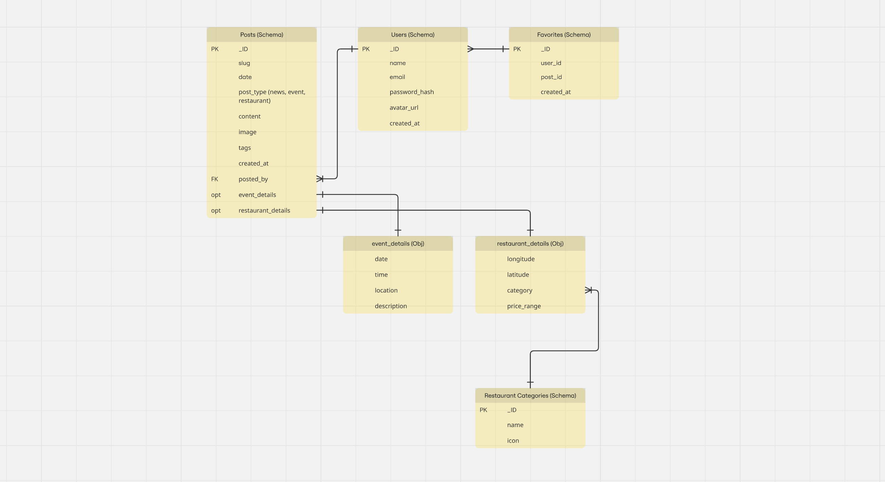

# +15 Skywalk - Backend API

## Overview

This repository contains the backend API for the +15 Skywalk website, a digital platform for Calgary's extensive elevated pedestrian walkway system. The +15 Skywalk connects over 100 buildings through 18 kilometers of climate-controlled pathways, making it the world's largest indoor pedestrian network.

## Project Purpose

The +15 Skywalk platform aims to solve navigation and discovery challenges by providing:

- A digital hub with real-time information about the walkway system
- Easy access to news and events happening in downtown Calgary
- A comprehensive directory of hospitality services (restaurants, cafes, shops) accessible via the +15
- User accounts with personalized favorites for frequent visitors

## Features

### Hospitality Directory

- Categorized listings of restaurants and services
- Detailed information including hours, location, and descriptions
- User favoriting functionality

### Event & News Management

- Downtown events listing
- News updates about the +15 system
- Categorized content organization

### Authentication System

- User registration and login
- Password encryption
- Profile management
- Favorites feature

## Tech Stack

- **Runtime**: Node.js
- **Framework**: Express.js
- **Database**: MongoDB with Mongoose ODM
- **Authentication**: JWT with bcrypt password encryption
- **Development**: Nodemon for hot reloading

## API Endpoints

### Authentication

```
POST /api/user/signup   - Create a new user account
POST /api/user/signin   - Log in with email and password
GET  /api/user/me       - Get current authenticated user
```

### Posts (News/Events/Restaurants)

```
GET    /api/posts               - Get all posts with filters
GET    /api/posts/:slug         - Get single post by slug
POST   /api/posts               - Create a new post (protected)
PUT    /api/posts/:id           - Update an existing post (protected)
DELETE /api/posts/:id           - Delete a post (protected)
```

### Favorites

```
GET    /api/favorites           - Get user's favorites
POST   /api/favorites           - Add an item to favorites
DELETE /api/favorites/:id       - Remove from favorites
```

### Subscribers

```
POST   /api/subscribers         - Add a new subscriber
```

## Data Models

### User

- name
- email (unique)
- password_hash
- avatar_url
- created_at
- isDeleted

### Post

- slug (unique)
- post_type (news, events, restaurants)
- posted_by (User reference)
- title
- content
- image
- tags
- category (reference)
- created_at
- event_details (conditional)
- restaurant_details (conditional)
- isDeleted

### Favorite

- user (User reference)
- post (Post reference)
- created_at

### Subscriber

- email
- subscribed_at

## Development Challenges

- **Data Limitations**: As a student project, access to real-time or official +15 data was limited
- **Scope Management**: Balancing feature development with timeline constraints

## Entity Relationship Diagram



## Getting Started

### Prerequisites

- Node.js (v14+)
- MongoDB

### Installation

```bash
# Clone the repository
git clone [repository-url]

# Install dependencies
npm install

# Create .env file with the following variables
MONGODB_URI=your_mongodb_connection_string
JWT_SECRET=your_jwt_secret

# Start development server
npm run dev
```

### Production

```bash
npm start
```

## Future Enhancements

- Real-time walkway access and closure updates
- Traffic level indicators
- Enhanced user profiles with saved routes
- Mobile application version
- CMS interface for content management
